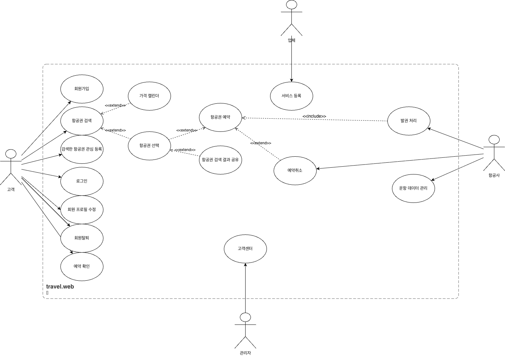
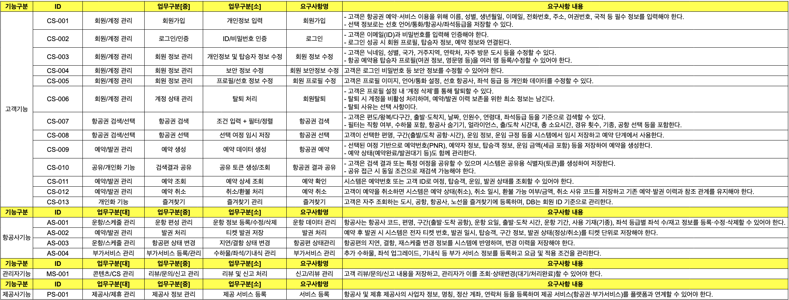
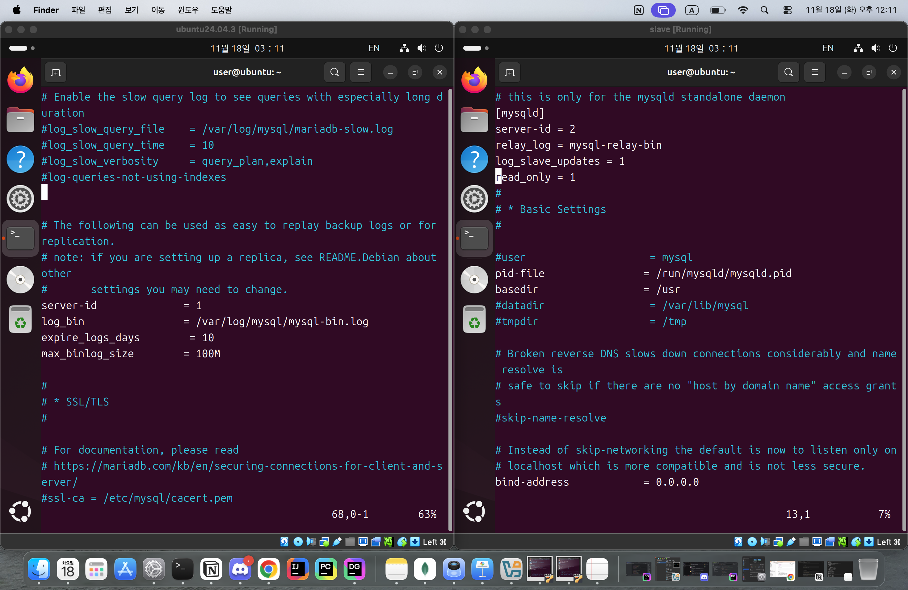
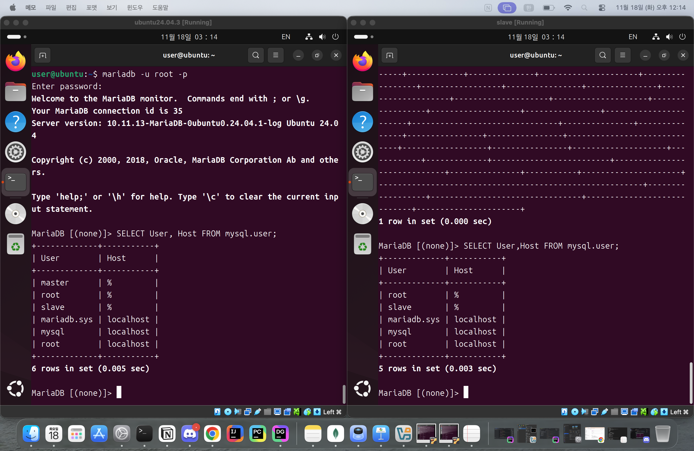

# 1. 프로젝트 간단 소개
#### 사이트 이용 고객에게 고객 니즈에 맞게 필터링을 통한 가장 빠르고 간단한 시스템이 장점인 시스템입니다. 불필요한 기능을 줄이고 실제 예약 서비스의 핵심 기능만 정확하게 구현하는 것이 목표로 프로그램 설계하였습니다.
## 2. 팀 소개
    - 강성훈(팀장) : 
    - 김신우(팀원) : DB 아키텍쳐 제작 및 수정, DB 정규화 작업
    - 정병진(팀원) : 전반적인 자료 수집, 데이터 수정 등 기획 서포터
    - /* 이유리(팀원) : 서기 */

--- 
## 3. 프로젝트 개요(주제 소개, 선정 이유(배경/필요성))
#### 3-1. 주제 소개
비행기 검색, 요금 비교, 예약, 탑승객 정보 입력, 발권까지 이어지는
항공 예약 전체 흐름을 구현한 미니 OTA(Online Travel Agency) 프로젝트.
#### 3-2. 선정 이유 (배경 / 필요성)
트립닷컴처럼 여러 기능이 통합된 플랫폼은 구조가 무겁고 로딩이 길어질 수 있어
사용자에게 가장 중요한 것은 빠른 항공권 검색 → 가격 비교 → 예약 과정을 강점을
부각시켜 선정하게 되었습니다.

우리는 호텔같은 부가 기능을 별도 제공사 테이블로 분리하고,
오직 항공 예약 기능에만 집중한 라이트한 서비스를 목표로 했습니다.

---
## 4. 유사 서비스 + 차이점 or 개선점
  트립닷컴은 비행기뿐만 아니라 호텔, 렌트카 등 예약할 수 있지만 데이터베이스가 무거워 로딩이 오래걸리는 단점이 있어
  비행기만 예약하는 것에 집중하여 가벼운 데이터 빠른 로딩으로 개선하여 라이트하게 만들었습니다.

<table border="1" cellspacing="0" cellpadding="8">
    <tr>
        <th>항목</th>
        <th>기존 서비스의 UX적 아쉬움</th>
        <th>우리의 개선 방향</th>
    </tr>
    <tr>
        <td>기능 범위</td>
        <td>비행기 + 호텔 + 렌터카 등 기능이 많아 초기 로딩 및 화면 이동이 상대적으로 복잡함</td>
        <td>기능을 비행기에만 집중해 단일 플로우 최적화</td>
    </tr>
    <tr>
        <td>검색 속도</td>
        <td>여러 API 및 옵션 조합으로 인해 검색 과정이 길게 느껴질 수 있음</td>
        <td>단일 DB 기반의 단순한 검색 로직으로 일관된 응답 속도 제공</td>
    </tr>
    <tr>
        <td>요금 표시</td>
        <td>기본 요금만 먼저 나오고 운임 규정(취소/변경 가능), 세금 구조가 한눈에 보기 어려움</td>
        <td>요금 구성(운임/세금/유류·발권 수수료)을 테이블 기반으로 명확히 분리 표시</td>
    </tr>
    <tr>
        <td>사용자 과정</td>
        <td>호텔·렌터카 등 부가 탭이 많아 항공 예약만 원하는 사람에게는 불필요한 정보</td>
        <td>항공 중심 UI로 핵심 플로우만 유지</td>
    </tr>
    <tr>
        <td>학습 곡선</td>
        <td>초보 사용자에게는 복잡하게 느껴질 수 있음</td>
        <td>“검색 → 비교 → 예약” 최소 단계로 라이트한 구조 설계</td>
    </tr>
</table>

## 서비스 대상
비행기 예약을 필요로 하는 사람 모두, 성격급한사람

## 주요 기능

    - 출발지, 도착지, 날짜별 항공권 조회
    - 빠른 결정을 내릴 수 있게 만든 검색 필터링 기능
    - 좌석 등급별 금액 도출
    - 운임, 세금, 유류할증료, 발권 수수료 분리
    - 즐겨찾기 기능을 통한 빠른 항공권 검색

## 개발 환경 및 기술 스택
	- 데이터베이스  : MariaDB
	- DB 툴 : DataGrip
	- 모델링 사이트 : ERD Cloud
    - 버전 컨트롤 : Git / GitHub
    - 프로젝트 관리 : Notion
    - 백업 프로그램 : Linux(Ubuntu)

## WBS
1.	요구사항 분석
2.	전체 도메인 정의
3.	ERD 설계
4.	테이블 설계 + DDL 작성
5.	샘플 데이터 생성
6.	SQL 테스트 시나리오 작성
7.	예약/발권 비즈니스 로직 구현
8.	테스트케이스 작성
9.	백업/복구 시나리오 적용
10.	문서화(README)

## Usecase Diagram (이미지 캡쳐)

## 요구 사항 명세서 (이미지 또는 전체 공개된 url)

 
## ERD (이미지)

## 테이블 정의서(이미지 또는 전체 공개된 url)
https://www.notion.so/ohgiraffers/2a9649136c11811a957ed22c05320077

## 백업 계획
- replication을 통한 master - slave 연결 로직, 실제 모습 캡쳐
  - Linux(Ubuntu) 설정 파일 이미지
  
  - MariaDB 계정 연동 확인 이미지
  

## 테스트케이스
    - 시나리오별 SQL 및 실행 결과

## 프로젝트 회고
- 오랜만에 요구사항 분석부터 DB 설계 및 구현까지 해보는 의미있는 프로젝트였다. 팀원들간의 소통이 원활하고 의사소통이 활발하여 큰 어려움 없이 프로젝트를 완료할 수 있었다. 앞으로의 팀 프로젝트도 기대가 된다.

- 병진
  - 느낀점 : 데이터베이스 전반적인 구조를 파악할 수 있는 좋은 프로젝트였고, 처음하는 협업 프로젝트를 진행하면서 팀원들에게 많은 도움을 받아 공부에 도움이 많이 됐습니다. 빨리 자바랑 연결해서 활용해보고 싶습니다.
  - 아쉬웠던 점 : 더많은 기능들을 추가하고 싶었지만 시간이 촉박했고, 분담하여 작업하는 일이 너무 중요하다고 느껴 다음 프로젝트에는 아쉬웠던 점 상기하여 보완해보겠습니다.
